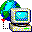
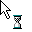

# Retrores
A catalog of cursors and icons from Windows 98, in original and modern formats

## Planned

* Add tons and tons of resources, automate conversion to various formats, and keep JSON metadata which could be considered an API
* An interface for browsing icons and cursors on the web
	* Search (by name and description/tags which can be progressively added, like 
	"Hourglass Hour Glass Sands of Time Waiting Loading Busy Timer Please Wait Progress Standby Stand By")
	* Preview cursors as cursors
	* Download files or copy base64 data URI

## Catalog

There are 3 items in the catalog so far. And the catalog is just a table. Humble beginnings :)

Italics <!-- or *asterisks* if you're reading this as a plain text file --> indicate there was no original title embedded in the cursor.

Name | Animated Cursor | Animated GIF
--|--|---
Hour Glass | [HOURGLAS.ANI](resources/cursors/ani/HOURGLAS.ANI) | [ HOURGLAS.GIF](resources/cursors/gif/HOURGLAS.GIF)
*Globe / downloading from the internet* | [GLOBE.ANI](resources/cursors/ani/GLOBE.ANI) | [ GLOBE.GIF](resources/cursors/gif/GLOBE.GIF)
Application Starting Hour Glass | [APPSTART.ANI](resources/cursors/ani/APPSTART.ANI) | [ APPSTART.GIF](resources/cursors/gif/APPSTART.GIF)

