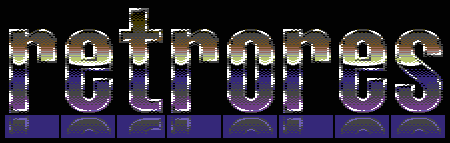

# 
A catalog of cursors and icons from Windows 98, in original and modern formats

There are 3 items in the catalog so far. Humble beginnings :)

[View it here](https://1j01.github.io/retrores)

## Planned

* Tons and tons of resources
* JSON metadata, which could be considered an API
	* Rich information like what DLL or EXE a file came from and the index within that source file, the operating system version it was retrieved from, copyright, etc.
* An interface for browsing icons and cursors on the web
	* Search (by name and description/tags which can be progressively added, like 
	"Hourglass Hour Glass Sands of Time Waiting Loading Busy Timer Please Wait Progress Standby Stand By")
	* Preview cursors as cursors
	* Download files or copy base64 data URI

TODO: automate extraction and conversion to various formats
